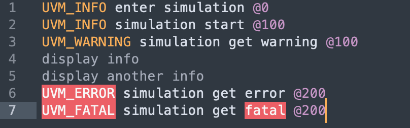

# Make your UVM-based simulation log more comfortable with UVMLog
Log and waveform are great pair for DVers to debug RTL or testbench. We can use commercial debug tools to analyze waveform, most of them, of course, allow us highlight waveform signal, mark signal, search value from waveform database, which help us a lot in waveform-based debugging.

However, when we want to analyze simulation process from simulation log, it's less convenient compared with waveform. One of the problem is we have to scan line by line from log file without any hint(or something like keyword highlighting in source code). That's why UVMLog exists.

# UVMLog for Sublime Text

In early stage, UVMLog is only support Sublime Text. UVMLog provide some highlighting in the log. UVM verbose level(UVM_INFO,UVM_ERROR,etc), trigger time, integer number and so on, which are considerately useful information, are highlighted.

If you open file extended with .log or .uvmlog, ST will automatically set UVMLog syntax for it.

Here is the log demo with UVMLog

You can find UVMLog package from package control
